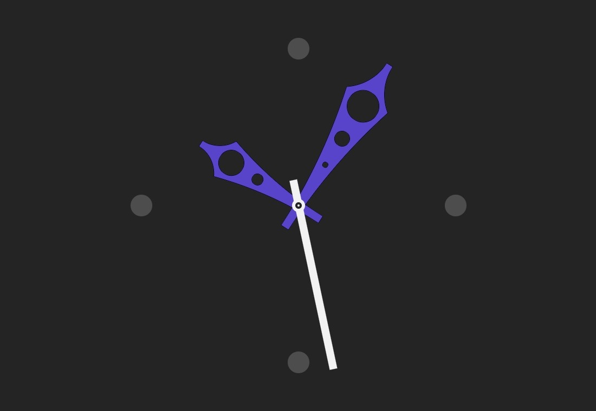

[][deployment]

# Animated Clock - create your own custom animation!

### Contents

- [Welcome](#1)
- [File Structure](#2)
- [Description](#3)
- [Browser Compatibility](#4)
- [by](#5)

### <a id="1">Welcome</a>

Have you been searching the net for a flexibly customizable clock widget for a long while? Congrats! You have finally ended up on the exact page you have been struggling for. Welcome to Animated Clock github repository, where you can find a few pretty useful files included to get your dream entirely fulfilled.

### <a id="2">File Structure</a>

- public:
    - [index.html][html]
- src:
    - [animated-clock.css][css]
    - [animated-clock.js][js]
- init:
    - [animated-clock.js][js_init] (*initial code*)

### <a id="3">Description</a>

Unobtrusively designed and bestowed with a great mechanism for customizable animation at the same time, this smart widget can be swiftly integrated into your website html code. What you need is just [a pinch of tags][html], [a chunk of styles][css] and [a chop of functions][js] from above.

['CUSTOM STYLES'][css] section is supposed to inspire you to try different colors and some extra styles to personalize your widget appearance.

['CUSTOM PARAMS'][js] section, on the other hand, allows you to create your own sequence of transitions including **any number of transition units** like it is [shown][deployment] down below:

```javascript
let animatedClock = {

    transitions: [
        {
            timings: {
                delay: 0,
                duration: 3000,
            },
            extraRotationValues: {
                hValue: -1,
                mValue: 1,
                sValue: 0,
            },
        },
        {
            timings: {
                delay: 2000,
                duration: 1000,
            },
            extraRotationValues: {
                hValue: 1,
                mValue: -1,
            },
        },
        {
            timings: {
                duration: 1000,
            },
            extraRotationValues: {
                hValue: -1,
                mValue: 2,
            },
        },
    ],
}
```

[Have a glance at what it looks like.][deployment]

### <a id="4">Browser Compatibility</a>

Generally friendly with most browsers as long as *rotate*, *transform*, *transition*, *animation* and *mix-blend-mode* css properties are supported. Does not work in IE and Samsung Internet browsers.

**Note** that it is not really the best way using css animation for moving hands in terms of time accuracy, but it does seem pretty decent as a particular way of embellishing your website.

### <a id="5">by</a>

[PapaProger](https://github.com/papaproger), first release on 12.02.2023. Copyright © 2023 [Sergey Shlyakhtin](https://www.linkedin.com/in/papaproger/). All rights reserved.

[deployment]: https://papaproger.github.io/animatedclock/
[html]: https://github.com/papaproger/animatedclock/blob/main/public/index.html
[css]: https://github.com/papaproger/animatedclock/blob/main/src/animated-clock.css
[js]: https://github.com/papaproger/animatedclock/blob/main/src/animated-clock.js
[js_init]: https://github.com/papaproger/animatedclock/blob/main/init/animated-clock.js